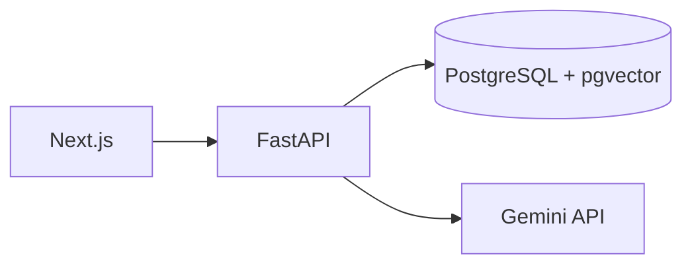

# Enterprise RAG Assistant

A placement-ready, multi-user PDF assistant: users register, upload PDFs, wait for background extraction and embedding, select documents for conversations, and receive Gemini answers with page-level citations.

## Architecture
PostgreSQL is both the relational and vector store. For a small-to-medium private document set, this keeps document ownership, chunk metadata, and vectors transactional in one deployable database and avoids synchronization complexity. `pgvector` provides cosine-ranked semantic retrieval; similarity is a ranking signal, **not** answer confidence.

## Start locally
1. `cp deployment/.env.example deployment/.env` and set `POSTGRES_PASSWORD`, a 16+ character `JWT_SECRET_KEY`, `GEMINI_API_KEY`, and optionally `GEMINI_MODEL`.
2. `docker compose -f deployment/docker-compose.yml up --build`
3. Open http://localhost:3000. API docs: http://localhost:8000/docs.

Stop with `docker compose -f deployment/docker-compose.yml down`; remove data with `docker compose -f deployment/docker-compose.yml down -v`.

## Commands
`make format`, `make lint`, `make typecheck`, `make test`, `make build`, `make migrate`.

## Current scope and limitations
Implemented: cookie JWT authentication, user-owned PDFs, background processing via FastAPI `BackgroundTasks`, sentence-aware chunks, BGE embeddings, pgvector retrieval, persistent conversations, Gemini grounded generation, and source snapshots. BackgroundTasks are intentionally not durable: in-progress files are marked failed after a restart and can be retried. Gemini requires your key.

Deferred: Qdrant, hybrid search, reranking, OCR, DOCX/TXT, Celery/Redis, refresh tokens, workspaces, evaluation dashboards, CI/CD, monitoring, and cloud deployment.
