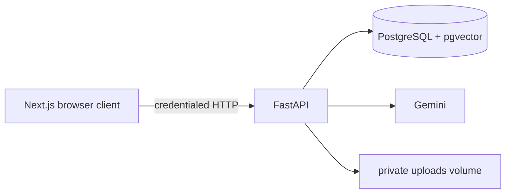

# Architecture

FastAPI is a modular monolith: routes orchestrate typed models and small focused services. `BackgroundTasks` performs PDF extraction after upload; it is deliberately lightweight and not durable across a backend restart. Startup converts interrupted `processing` documents to `failed` so the user can retry.

PostgreSQL is both the relational source of truth and vector store. pgvector HNSW cosine search is scoped by the JWT-derived user and selected document IDs. This avoids operational synchronization with a separate vector database for the expected small-to-medium corpus. Similarity ranks candidate passages; it is not a probability that an answer is correct.
